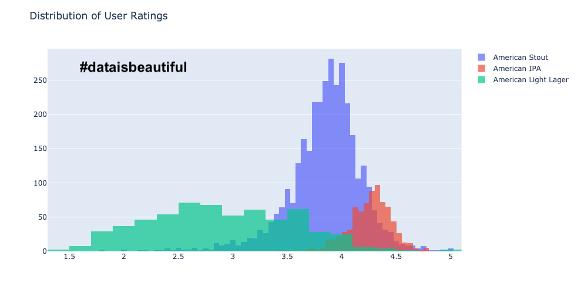
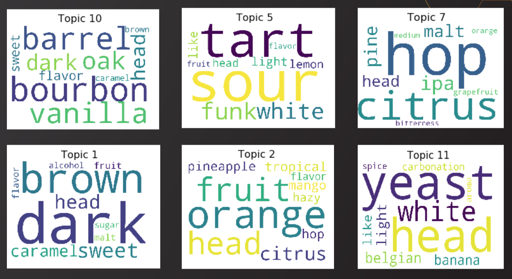
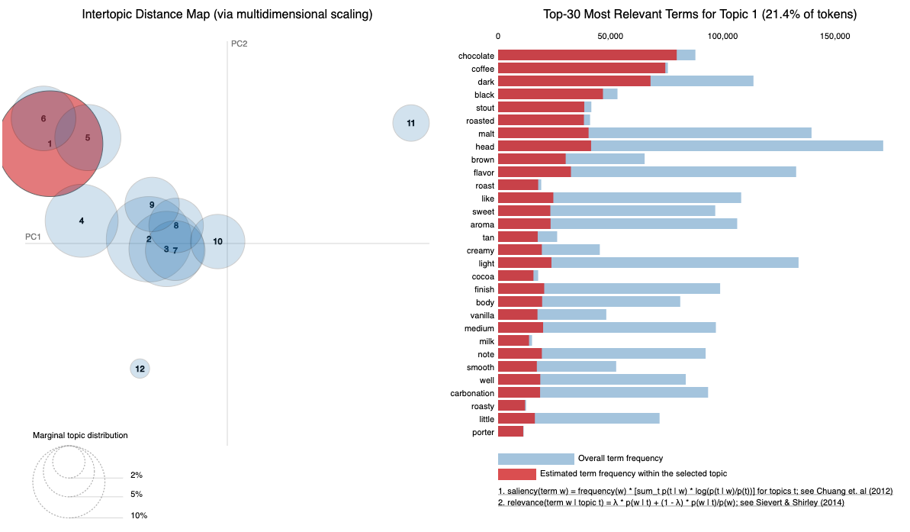
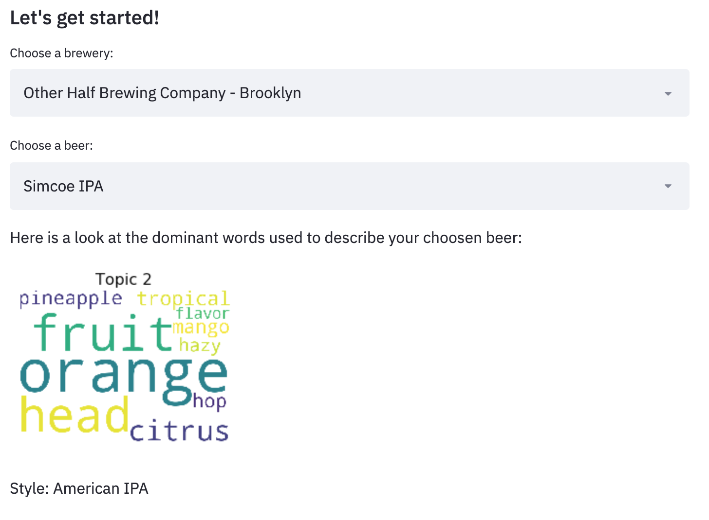
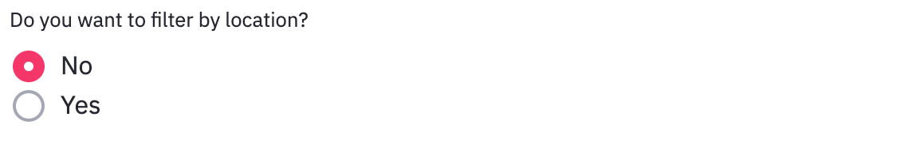
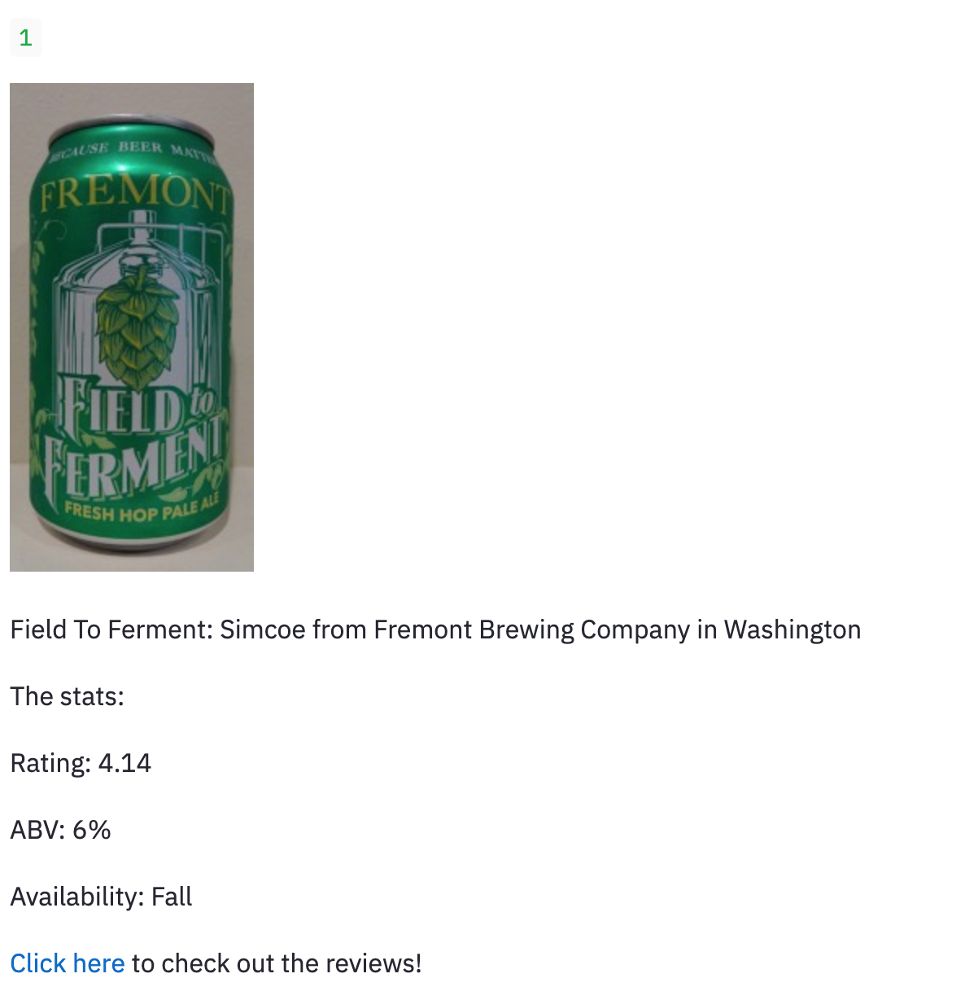
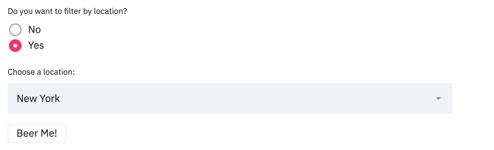
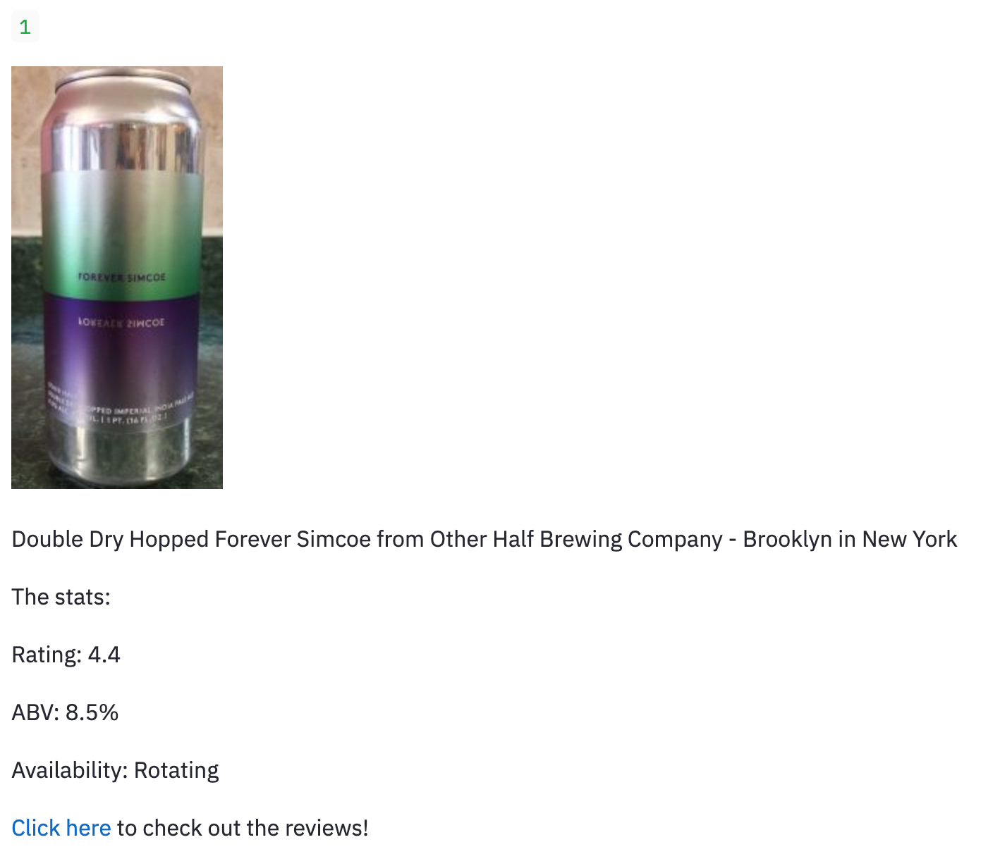

# Beer Recommendation
Sarah Smith

- [Data](#data)
- [EDA](#eda)
- [Model](#model)
- [Final Recommendation System](#sys)
- [Futher Steps](#steps)

## Project Goals
The goal of this project is to build a content-based item to item beer recommender based on the language used to describe the beers. With the growth of craft beer, styles like "IPA" and "Stout" are no longer enough to describe individual beers, this recommender aims to move past that and find the nuances in the language used to describe individual beers and recommend the user the most simliarly described beer.

## Data Collection 
I used beautiful soup to scrape all ~200,000 beers from [BeerAdvocate](https://www.beeradvocate.com/). I got the following information for each beer:
- ABV
- Availability (seasonal, year-round etc)
- Rating
- Style
- Brewery
- Image
- Location
- Number of Ratings
- Number of Reviews
- First 25 Reviews

## EDA 
### Data Cleaning
I chose to drop the beers that had no written reviews about them as that is the basis for the recommendation. This left me with ~100,000 beers.

### Data Exploration
As part of the data exploration, one of the more interesting things I found was the difference in distribution of rating between styles. Below is a visualization of the difference between 3 different styles:

### Topic Modelling
As part of the EDA, I did LDA topic modelling using NLP and bag of words. Here is a visualization of the most common words in 6 of the 12 topics:

And a look at the LDA visualization:

## Recommender Model 
The recommender was built using NLP to tokenize, remove stopwords and lemmatize the reviews of each of the beers.
I then used a count vectorizer and cosine simliarity to build a similarity matrix. 

## Final Recommendation System 
For the final recommender, the user inputs a beer that they like and will get the 3 most similar beers based on the description. The user can also filter by location, giving only beers in that location.
I built a front-end using streamlit - here is a look at how it works:

### Or, filtering by location:

## Further Steps 
- Put app live online
- Add functionality to take in descriptors as user input.
- Add business functionality:
  - Allow breweries to have just their own beers for users to choose from, after inputting either an old beer of the brewery or another common beer.
  - Allow restaurants to customize to their beer list.
